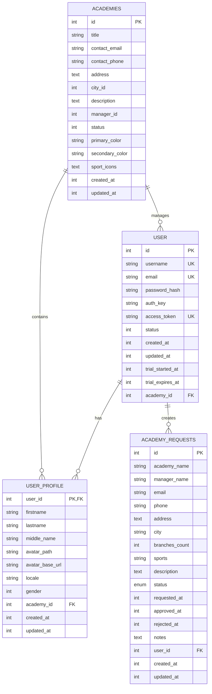

# Database Schema - Vult Subscription System

## Overview
This document provides a comprehensive overview of the database schema for the Vult Subscription System, including table structures, relationships, and constraints.

## Database Information
- **Engine**: MySQL 8.0+
- **Character Set**: utf8mb4
- **Collation**: utf8mb4_unicode_ci
- **Timezone**: UTC

## Core Tables

### 1. User Table
**Table Name**: `user`

Stores user information including trial management data.

| Column | Type | Constraints | Description |
|--------|------|-------------|-------------|
| `id` | INT | PRIMARY KEY, AUTO_INCREMENT | Unique user identifier |
| `username` | VARCHAR(255) | UNIQUE, NOT NULL | Username for login |
| `email` | VARCHAR(255) | UNIQUE, NOT NULL | User email address |
| `password_hash` | VARCHAR(255) | NOT NULL | Hashed password |
| `auth_key` | VARCHAR(32) | NOT NULL | Authentication key |
| `access_token` | VARCHAR(40) | UNIQUE | API access token |
| `status` | TINYINT | NOT NULL, DEFAULT 2 | User status (1=inactive, 2=active, 3=deleted) |
| `created_at` | INT | NOT NULL | Creation timestamp |
| `updated_at` | INT | NOT NULL | Last update timestamp |
| `logged_at` | INT | NULL | Last login timestamp |
| `mobile` | VARCHAR(20) | NULL | Mobile phone number |
| `user_type` | TINYINT | NOT NULL, DEFAULT 0 | User type (0=customer, 1=player, 2=trainer, 3=academy_admin) |
| `trial_started_at` | INT | NULL | Trial start timestamp |
| `trial_expires_at` | INT | NULL | Trial expiry timestamp |
| `academy_id` | INT | NULL | Associated academy ID |

**Indexes:**
- `PRIMARY KEY` on `id`
- `UNIQUE KEY` on `username`
- `UNIQUE KEY` on `email`
- `UNIQUE KEY` on `access_token`
- `INDEX` on `trial_started_at`
- `INDEX` on `trial_expires_at`
- `INDEX` on `academy_id`

### 2. Academy Requests Table
**Table Name**: `academy_requests`

Stores academy registration requests and their approval status.

| Column | Type | Constraints | Description |
|--------|------|-------------|-------------|
| `id` | INT | PRIMARY KEY, AUTO_INCREMENT | Unique request identifier |
| `academy_name` | VARCHAR(255) | NOT NULL | Name of the academy |
| `manager_name` | VARCHAR(255) | NOT NULL | Manager's full name |
| `email` | VARCHAR(255) | NOT NULL | Manager's email address |
| `phone` | VARCHAR(255) | NOT NULL | Manager's phone number |
| `address` | TEXT | NULL | Academy address |
| `city` | VARCHAR(255) | NULL | City name |
| `branches_count` | INT | NOT NULL | Number of academy branches |
| `sports` | VARCHAR(255) | NULL | Comma-separated list of sports |
| `description` | TEXT | NULL | Academy description |
| `status` | ENUM | NOT NULL, DEFAULT 'pending' | Request status (pending, approved, rejected, expired) |
| `requested_at` | INT | NOT NULL | Request timestamp |
| `approved_at` | INT | NULL | Approval timestamp |
| `rejected_at` | INT | NULL | Rejection timestamp |
| `notes` | TEXT | NULL | Admin notes |
| `created_by` | INT | NULL | User who created the record |
| `updated_by` | INT | NULL | User who last updated the record |
| `portal_academy_id` | INT | NULL | Associated academy ID in portal |
| `portal_user_id` | INT | NULL | Associated user ID in portal |
| `user_id` | INT | NULL | Associated user ID |
| `created_at` | INT | NULL | Record creation timestamp |
| `updated_at` | INT | NULL | Record update timestamp |

**Indexes:**
- `PRIMARY KEY` on `id`
- `INDEX` on `status`
- `INDEX` on `requested_at`
- `INDEX` on `email`
- `FOREIGN KEY` on `user_id` references `user(id)`

### 3. Academies Table
**Table Name**: `academies`

Stores approved academy information.

| Column | Type | Constraints | Description |
|--------|------|-------------|-------------|
| `id` | INT | PRIMARY KEY, AUTO_INCREMENT | Unique academy identifier |
| `title` | VARCHAR(255) | NOT NULL | Academy name |
| `contact_email` | VARCHAR(255) | NOT NULL | Contact email |
| `contact_phone` | VARCHAR(255) | NOT NULL | Contact phone |
| `address` | TEXT | NULL | Academy address |
| `city_id` | INT | NULL | City identifier |
| `description` | TEXT | NULL | Academy description |
| `manager_id` | INT | NULL | Manager user ID |
| `status` | TINYINT | NOT NULL, DEFAULT 1 | Academy status |
| `primary_color` | VARCHAR(7) | NULL | Primary brand color |
| `secondary_color` | VARCHAR(7) | NULL | Secondary brand color |
| `sport_icons` | TEXT | NULL | JSON array of sport icons |
| `created_at` | INT | NOT NULL | Creation timestamp |
| `updated_at` | INT | NOT NULL | Last update timestamp |

**Indexes:**
- `PRIMARY KEY` on `id`
- `INDEX` on `city_id`
- `INDEX` on `manager_id`
- `INDEX` on `status`

### 4. User Profile Table
**Table Name**: `user_profile`

Extended user profile information.

| Column | Type | Constraints | Description |
|--------|------|-------------|-------------|
| `user_id` | INT | PRIMARY KEY | User ID (foreign key) |
| `firstname` | VARCHAR(255) | NULL | First name |
| `lastname` | VARCHAR(255) | NULL | Last name |
| `middle_name` | VARCHAR(255) | NULL | Middle name |
| `avatar_path` | VARCHAR(255) | NULL | Avatar file path |
| `avatar_base_url` | VARCHAR(255) | NULL | Avatar base URL |
| `locale` | VARCHAR(32) | NOT NULL, DEFAULT 'en-US' | User locale |
| `gender` | TINYINT | NULL | Gender (0=male, 1=female) |
| `academy_id` | INT | NULL | Associated academy ID |
| `created_at` | INT | NULL | Creation timestamp |
| `updated_at` | INT | NULL | Last update timestamp |

**Indexes:**
- `PRIMARY KEY` on `user_id`
- `INDEX` on `academy_id`
- `FOREIGN KEY` on `user_id` references `user(id)`
- `FOREIGN KEY` on `academy_id` references `academies(id)`

## Relationship Diagram



## Data Types Reference

### Integer Types
- `TINYINT`: -128 to 127 (signed) or 0 to 255 (unsigned)
- `INT`: -2,147,483,648 to 2,147,483,647 (signed) or 0 to 4,294,967,295 (unsigned)
- `BIGINT`: Large integer values

### String Types
- `VARCHAR(n)`: Variable-length string up to n characters
- `TEXT`: Variable-length string up to 65,535 characters
- `ENUM`: One value from a predefined list

### Date/Time Types
- `INT`: Unix timestamp (used for created_at, updated_at, etc.)
- `DATETIME`: Date and time in 'YYYY-MM-DD HH:MM:SS' format

## Constraints and Rules

### Foreign Key Constraints
```sql
-- User to Academy Requests
ALTER TABLE academy_requests 
ADD CONSTRAINT fk_academy_requests_user_id 
FOREIGN KEY (user_id) REFERENCES user(id) 
ON DELETE SET NULL ON UPDATE CASCADE;

-- User Profile to User
ALTER TABLE user_profile 
ADD CONSTRAINT fk_user_profile_user_id 
FOREIGN KEY (user_id) REFERENCES user(id) 
ON DELETE CASCADE ON UPDATE CASCADE;

-- User Profile to Academy
ALTER TABLE user_profile 
ADD CONSTRAINT fk_user_profile_academy_id 
FOREIGN KEY (academy_id) REFERENCES academies(id) 
ON DELETE SET NULL ON UPDATE CASCADE;
```

### Check Constraints
```sql
-- User status validation
ALTER TABLE user 
ADD CONSTRAINT chk_user_status 
CHECK (status IN (1, 2, 3));

-- Academy request status validation
ALTER TABLE academy_requests 
ADD CONSTRAINT chk_academy_request_status 
CHECK (status IN ('pending', 'approved', 'rejected', 'expired'));

-- User type validation
ALTER TABLE user 
ADD CONSTRAINT chk_user_type 
CHECK (user_type IN (0, 1, 2, 3, 4, 5));
```

## Indexing Strategy

### Primary Indexes
- All tables have primary key on `id` column
- User table has unique indexes on `username`, `email`, and `access_token`

### Performance Indexes
- `idx_user_trial_expires_at`: For trial expiry queries
- `idx_academy_requests_status`: For filtering by request status
- `idx_academy_requests_requested_at`: For date-based queries
- `idx_user_profile_academy_id`: For academy-based user queries

### Composite Indexes
```sql
-- For complex queries on academy requests
CREATE INDEX idx_academy_requests_status_created 
ON academy_requests (status, created_at);

-- For user trial queries
CREATE INDEX idx_user_trial_status 
ON user (trial_expires_at, status);
```

## Data Validation Rules

### Email Validation
- Must be valid email format
- Must be unique within the system
- Required for user registration and academy requests

### Phone Validation
- Saudi format: `+966XXXXXXXXX` or `05XXXXXXXX`
- Egyptian format: `+20XXXXXXXXXX` or `01XXXXXXXXX`
- Must match regex pattern: `/^((009665|9665|\+9665|05|5)(5|0|3|6|4|9|1|8|7)([0-9]{7})|(\+2|002|2)(10|11|12|15)([\d]{8})|(0)(10|11|12|15)([\d]{8}))$/`

### Status Validation
- User status: 1 (inactive), 2 (active), 3 (deleted)
- Academy request status: pending, approved, rejected, expired
- User type: 0 (customer), 1 (player), 2 (trainer), 3 (academy_admin), 4 (custom), 5 (talent)

## Migration History

### Version 1.0.0
- Initial database schema
- User table with trial fields
- Academy requests table
- User profile table
- Basic indexes and constraints

### Future Migrations
- Add subscription plans table
- Add payment transactions table
- Add notification preferences table
- Add audit log table

## Backup and Recovery

### Backup Strategy
```sql
-- Full database backup
mysqldump -u username -p vult_subscription > backup_$(date +%Y%m%d).sql

-- Structure only backup
mysqldump -u username -p --no-data vult_subscription > structure_backup.sql

-- Data only backup
mysqldump -u username -p --no-create-info vult_subscription > data_backup.sql
```

### Recovery Procedures
```sql
-- Restore from backup
mysql -u username -p vult_subscription < backup_20240115.sql

-- Restore structure only
mysql -u username -p vult_subscription < structure_backup.sql

-- Restore data only
mysql -u username -p vult_subscription < data_backup.sql
```

---

**Last Updated:** 2024-01-15  
**Version:** 1.0  
**Maintainer:** Vult Development Team
